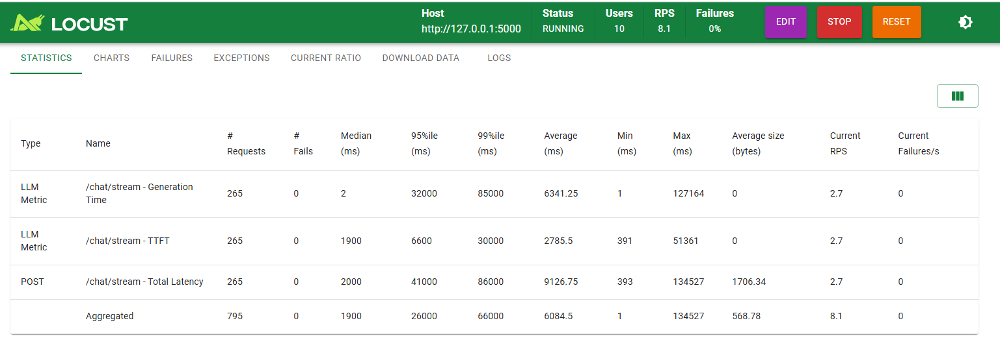

# Model Deployment (FastAPI + OpenRouter)

This repository contains a small FastAPI application that streams model responses through OpenRouter.



## Overview

- App entry: `src/main.py` (FastAPI)
- Routes: `src/routes/` (chat endpoints)
- Load testing: `locustfile.py`

## Prerequisites

- Docker
- Python 3.11 (for local dev)
- `OPEN_ROUTER_API_KEY` (register at OpenRouter or use your provider)

## Environment (.env)

Create a `.env` file at the project root (next to `Dockerfile` and `requirements.txt`). You can copy the example:

Windows (cmd):
```
copy .env.example .env
notepad .env
```

Example `.env` contents:
```
OPEN_ROUTER_API_KEY=your_openrouter_api_key_here
APP_NAME=My Model Deployment
```

The app loads environment variables via Pydantic Settings (`src/helpers/settings.py`).

## Local development (virtual env)

Create and activate a virtual environment, then install requirements:

Windows (cmd):
```
python -m venv .venv
.\.venv\Scripts\activate
python -m pip install --upgrade pip
python -m pip install -r requirements.txt
```

Run the app locally:
```
python -m uvicorn src.main:app --host 127.0.0.1 --port 8000
```

## Docker

Build the image:
```bash
docker build -t model_deployment:latest -f Model_Deployment/Dockerfile Model_Deployment
```

Run with the `.env` file:
```bash
docker run --env-file Model_Deployment/.env -p 8000:8000 model_deployment:latest
```

You can also pass the API key directly:
```bash
docker run -e OPEN_ROUTER_API_KEY=your_key -p 8000:8000 model_deployment:latest
```

The container uses a small `uv` wrapper to run Uvicorn (`uv src.main:app`).

## Load testing (Locust)

The project includes a `locustfile.py` for performance testing. To run Locust locally (after installing requirements):

```
locust -f locustfile.py --host=http://127.0.0.1:8000
```

Open the Locust web UI (default `http://127.0.0.1:8089`) to start a test. Save or paste the Locust screenshot to `docs/locust_stats.png` so it appears in this README (the image above).


## Write-up — Serving 50 concurrent users in production

To support roughly 50 concurrent users in production, the architecture and operational model should be hardened for reliability, latency, and cost. Key additions:

- Autoscaling: run the service in a container orchestrator (Kubernetes, Cloud Run, or managed container service) and configure horizontal autoscaling (HPA) based on CPU, memory, and request latency or RPS. Start with 2–3 replicas and scale up automatically when latency or CPU rises.

- Concurrency and workers: use an ASGI server configuration tuned for async I/O (Uvicorn with multiple workers or Gunicorn+Uvicorn workers). For CPU-light async workloads, favor more async workers and rely on many concurrent connections per worker.

- Batching: where requests can be combined safely, implement server-side batching to group small inference requests before sending to the model provider. Batching reduces per-request overhead and can improve throughput at the cost of slight added latency.

- Queueing: introduce a request queue (Redis, RabbitMQ) for long-running or high-cost operations. Frontend requests can be acknowledged quickly; heavy processing is handled by worker consumers and results delivered via WebSocket, polling, or push notifications.

- Caching: cache deterministic outputs (for identical prompts) and intermediate results using Redis or an in-memory cache with TTL. This reduces calls to the upstream OpenRouter API for repeated prompts.

- Connection pooling and retries: reuse the `AsyncOpenAI` client across requests, use connection pooling, and implement exponential backoff and retry limits for transient upstream errors.

- Observability and health: add metrics (Prometheus), request tracing, structured logs, and liveness/readiness probes so the orchestrator can manage rollouts and traffic shifts gracefully.

- Secret management and rate limits: store `OPEN_ROUTER_API_KEY` in a secret manager (Kubernetes Secrets, Azure Key Vault) rather than plain `.env`; enforce per-user rate limits and global request throttling to protect against spikes.

These changes improve reliability and scalability for 50 concurrent users while balancing latency and cost.

